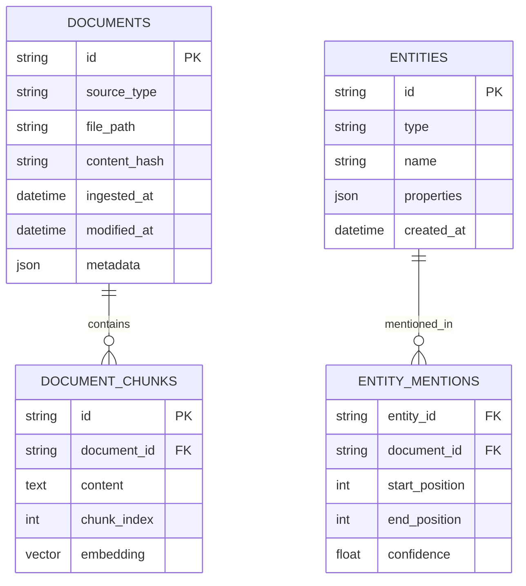
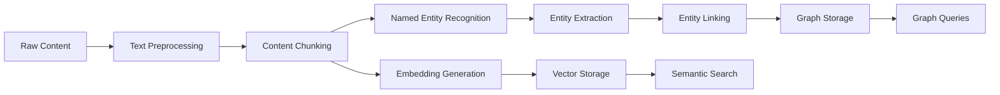
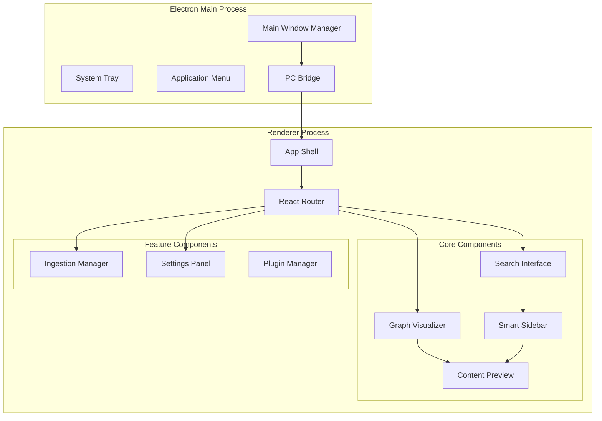
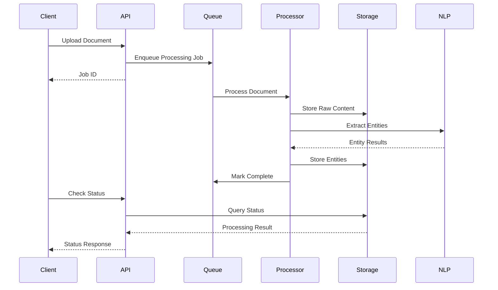

# AutoOrganize: Personal Knowledge Management System Design

## Overview

AutoOrganize is a comprehensive personal knowledge management system that combines universal data ingestion, semantic graph construction, and proactive intelligence to help users organize and discover information across multiple platforms and data sources.

### Core Value Proposition
- **Universal Data Integration**: Seamlessly connect and organize data from local files, emails, cloud services, development tools, and communication platforms
- **Intelligent Organization**: Automatically extract entities, relationships, and context to build a semantic understanding of user data
- **Proactive Insights**: Surface relevant information and provide contextual suggestions based on user behavior and data patterns
- **Privacy-First Architecture**: Local-first approach with optional self-hosted synchronization and end-to-end encryption

## Architecture

### High-Level System Architecture

```mermaid
graph TB
    subgraph "Data Sources"
        FS[File System]
        EMAIL[Email/IMAP]
        CLOUD[Drive/Dropbox]
        DEV[GitHub/GitLab]
        COMM[Slack/Teams]
        BROWSER[Browser Bookmarks]
    end
    
    subgraph "Rust Core Agents (Shared Libraries)"
        WATCHER[File Watchers]
        INGESTION[Document Ingestion]
        CRYPTO[Encryption Engine]
        SYNC[Sync Engine]
        INDEXER[Content Indexer]
    end
    
    subgraph "Storage Layer"
        SQLITE[SQLite + FTS5]
        ROCKS[RocksDB]
        NEO4J[Neo4j Community]
    end
    
    subgraph "Processing Layer"
        NLP[NLP Engine (Rust)]
        ENTITY[Entity Extraction]
        GRAPH[Graph Builder]
        SEARCH[Search Engine]
    end
    
    subgraph "Application Layer"
        API[Node.js API]
        ELECTRON[Electron Desktop]
        WEB[React Web App]
        RN_APP[React Native App]
    end
    
    subgraph "Native Modules (Platform-Specific)"
        ANDROID_BG[Android Background Tasks]
        IOS_BG[iOS Background Fetch]
        ANDROID_INTENTS[Android Intent Handlers]
        IOS_SHORTCUTS[iOS Shortcuts]
    end
    
    FS --> WATCHER
    EMAIL --> WATCHER
    CLOUD --> SYNC
    DEV --> SYNC
    COMM --> SYNC
    BROWSER --> WATCHER
    
    WATCHER --> INGESTION
    SYNC --> INGESTION
    INGESTION --> CRYPTO
    CRYPTO --> SQLITE
    
    SQLITE --> NLP
    ROCKS --> GRAPH
    NEO4J --> SEARCH
    
    NLP --> ENTITY
    ENTITY --> GRAPH
    GRAPH --> SEARCH
    
    API --> ELECTRON
    API --> WEB
    API --> RN_APP
    
    RN_APP --> ANDROID_BG
    RN_APP --> IOS_BG
    RN_APP --> ANDROID_INTENTS
    RN_APP --> IOS_SHORTCUTS
```

### Component Architecture

#### 1. Ingestion Layer Components

**Rust Core Agents (Shared Libraries)**
- Cross-platform file system watchers with FFI bindings
- Unified document ingestion pipeline
- Encryption/decryption engine using libsodium
- Sync coordination between devices
- Content indexing and metadata extraction
- Exposed via C-compatible FFI for React Native integration

**React Native Mobile App**
- Cross-platform UI layer with primary Android focus
- FFI bridge to Rust core agents
- Document capture and scanning capabilities
- Push notification integration for sync events
- Native modules only for platform-specific OS integrations

**Native Modules (Minimal, Platform-Specific)**
- Android: Advanced background processing, intent handling
- iOS: Background fetch, app shortcuts integration
- Only created when React Native capabilities are insufficient

#### 2. Storage Layer Architecture

**SQLite with FTS5**


**RocksDB Graph Metadata**
- Key-value storage for graph relationships
- Fast lookup for entity connections
- Temporal relationship tracking

**Neo4j Community Edition**
- Complex graph queries and traversals
- Relationship strength calculations
- Pattern matching for similar content

#### 3. Processing Pipeline

**NLP Processing Flow**


**Entity Types and Extraction**
- **People**: Names, roles, contact information
- **Organizations**: Companies, departments, teams
- **Temporal**: Dates, deadlines, schedules
- **Financial**: Invoices, budgets, transactions
- **Technical**: Code repositories, APIs, documentation
- **Projects**: Milestones, tasks, deliverables

## Technology Stack & Dependencies

### Backend Technologies
- **Runtime**: Node.js 18+ with TypeScript
- **API Framework**: tRPC for type-safe APIs
- **Database**: SQLite with FTS5, RocksDB, Neo4j Community
- **Core Agents**: Rust libraries with FFI bindings
- **NLP**: Sentence Transformers via ONNX Runtime (Rust)
- **Security**: libsodium for encryption (Rust), Keycloak for identity

### Frontend Technologies
- **Desktop**: Electron with React 18+ and Recoil
- **Web**: React 18+ with static deployment
- **Mobile**: React Native with Expo (primary Android focus, iOS compatible)
- **Styling**: Tailwind CSS with component library

### Mobile Development Stack
- **Framework**: React Native 0.72+ with Expo 49+
- **Core Logic**: Rust shared libraries via FFI
- **Navigation**: React Navigation 6
- **State Management**: Recoil (shared with desktop)
- **Background Tasks**: Native modules for Android, limited iOS background sync
- **File System**: Expo FileSystem + Rust file watchers
- **Camera**: Expo Camera for document scanning
- **Notifications**: Expo Notifications for sync alerts
- **Storage**: AsyncStorage + SQLite (expo-sqlite) + Rust indexing
- **Network**: Axios with Rust sync engine
- **Android Focus**: Advanced background processing, file system access, intent handling
- **iOS Compatibility**: Basic functionality with iOS background limitations

### Rust Core Libraries
- **Language**: Rust 1.70+ with stable FFI
- **FFI Bindings**: uniffi-rs for automatic binding generation
- **File Watching**: notify crate for cross-platform file monitoring
- **Encryption**: sodiumoxide for libsodium bindings
- **Database**: rusqlite for SQLite integration
- **HTTP**: reqwest for API communication
- **JSON**: serde for serialization
- **Async Runtime**: tokio for concurrent operations
- **Platform Integration**: Platform-specific crates for deep OS integration

### Infrastructure
- **Containerization**: Docker and Docker Compose
- **CI/CD**: GitHub Actions
- **Monitoring**: Prometheus + Grafana (self-hosted)
- **Error Tracking**: Sentry OSS

## Component Architecture

### Mobile Application Architecture (React Native + Rust FFI)

```mermaid
graph TD
    subgraph "React Native Layer"
        NAV[Navigation Stack]
        
        subgraph "Core Screens"
            HOME[Home Dashboard]
            SEARCH_MOBILE[Search Screen]
            CAMERA[Document Scanner]
            SYNC[Sync Status]
        end
        
        subgraph "FFI Bridge Layer"
            BRIDGE[Rust FFI Bridge]
            EVENTS[Event Listeners]
            CALLBACKS[Callback Handlers]
        end
    end
    
    subgraph "Rust Core Agents"
        WATCHER_LIB[File Watcher Library]
        INGESTION_LIB[Ingestion Library]
        CRYPTO_LIB[Encryption Library]
        SYNC_LIB[Sync Library]
        SEARCH_LIB[Search Library]
    end
    
    subgraph "Native Modules (Minimal)"
        ANDROID_BG[Android Background Service]
        IOS_BG[iOS Background Tasks]
        ANDROID_INTENTS[Android Intent Handler]
    end
    
    subgraph "Storage (Rust-Managed)"
        SQLITE_RUST[SQLite (Rust)]
        ROCKS_RUST[RocksDB (Rust)]
        FILE_INDEX[File Index (Rust)]
    end
    
    NAV --> HOME
    NAV --> SEARCH_MOBILE
    NAV --> CAMERA
    NAV --> SYNC
    
    HOME --> BRIDGE
    SEARCH_MOBILE --> BRIDGE
    CAMERA --> BRIDGE
    SYNC --> BRIDGE
    
    BRIDGE --> WATCHER_LIB
    BRIDGE --> INGESTION_LIB
    BRIDGE --> CRYPTO_LIB
    BRIDGE --> SYNC_LIB
    BRIDGE --> SEARCH_LIB
    
    WATCHER_LIB --> SQLITE_RUST
    INGESTION_LIB --> ROCKS_RUST
    SEARCH_LIB --> FILE_INDEX
    
    BRIDGE --> ANDROID_BG
    BRIDGE --> IOS_BG
    BRIDGE --> ANDROID_INTENTS
```

### Desktop Application Components



### Search Interface Component
```typescript
interface SearchProps {
  onResultSelect: (result: SearchResult) => void;
  contextFilters: EntityType[];
  timeRange?: TimeRange;
}

interface SearchResult {
  id: string;
  type: 'document' | 'entity' | 'relationship';
  title: string;
  snippet: string;
  relevanceScore: number;
  source: DataSource;
  metadata: Record<string, any>;
}
```

### Rust FFI Integration Examples

```rust
// Rust Core Library (autoorganize-core/src/lib.rs)
use std::ffi::{CStr, CString};
use std::os::raw::c_char;
use tokio::runtime::Runtime;

// Document ingestion engine
pub struct DocumentIngester {
    runtime: Runtime,
    db_path: String,
}

impl DocumentIngester {
    pub fn new(db_path: &str) -> Self {
        Self {
            runtime: Runtime::new().unwrap(),
            db_path: db_path.to_string(),
        }
    }
    
    pub async fn ingest_document(&self, file_path: &str) -> Result<DocumentInfo, String> {
        // Core ingestion logic
        let content = std::fs::read_to_string(file_path)
            .map_err(|e| format!("Failed to read file: {}", e))?;
        
        let doc_info = self.process_document(content).await?;
        self.store_document(doc_info.clone()).await?;
        
        Ok(doc_info)
    }
}

// FFI exports for React Native
#[no_mangle]
pub extern "C" fn create_ingester(db_path: *const c_char) -> *mut DocumentIngester {
    let c_str = unsafe { CStr::from_ptr(db_path) };
    let db_path = c_str.to_str().unwrap();
    Box::into_raw(Box::new(DocumentIngester::new(db_path)))
}

#[no_mangle]
pub extern "C" fn ingest_document_ffi(
    ingester: *mut DocumentIngester,
    file_path: *const c_char,
    callback: extern "C" fn(*const c_char),
) {
    let ingester = unsafe { &mut *ingester };
    let c_str = unsafe { CStr::from_ptr(file_path) };
    let file_path = c_str.to_str().unwrap();
    
    let result = ingester.runtime.block_on(async {
        ingester.ingest_document(file_path).await
    });
    
    let response = match result {
        Ok(doc_info) => serde_json::to_string(&doc_info).unwrap(),
        Err(error) => format!(r#"{{"error": "{}"}}", error),
    };
    
    let c_response = CString::new(response).unwrap();
    callback(c_response.as_ptr());
}

// File watcher with event callbacks
pub struct FileWatcher {
    callback: Option<extern "C" fn(*const c_char)>,
}

#[no_mangle]
pub extern "C" fn create_file_watcher(
    watch_path: *const c_char,
    callback: extern "C" fn(*const c_char),
) -> *mut FileWatcher {
    let c_str = unsafe { CStr::from_ptr(watch_path) };
    let watch_path = c_str.to_str().unwrap();
    
    let mut watcher = FileWatcher { callback: Some(callback) };
    watcher.start_watching(watch_path);
    
    Box::into_raw(Box::new(watcher))
}
```

```typescript
// React Native FFI Bridge (src/native/RustBridge.ts)
import { NativeModules } from 'react-native';

interface RustCoreModule {
  createIngester(dbPath: string): Promise<number>; // Returns pointer
  ingestDocument(ingesterPtr: number, filePath: string): Promise<string>;
  createFileWatcher(watchPath: string): Promise<number>;
  destroyIngester(ptr: number): void;
}

const { RustCore } = NativeModules as { RustCore: RustCoreModule };

class AutoOrganizeCore {
  private ingesterPtr: number | null = null;
  private watcherPtr: number | null = null;
  
  async initialize(dbPath: string): Promise<void> {
    this.ingesterPtr = await RustCore.createIngester(dbPath);
  }
  
  async ingestDocument(filePath: string): Promise<DocumentInfo> {
    if (!this.ingesterPtr) {
      throw new Error('Core not initialized');
    }
    
    const result = await RustCore.ingestDocument(this.ingesterPtr, filePath);
    const parsed = JSON.parse(result);
    
    if (parsed.error) {
      throw new Error(parsed.error);
    }
    
    return parsed as DocumentInfo;
  }
  
  async startFileWatching(watchPath: string, onFileChange: (event: FileEvent) => void): Promise<void> {
    // Setup global callback handler
    global.fileWatcherCallback = (eventJson: string) => {
      const event = JSON.parse(eventJson) as FileEvent;
      onFileChange(event);
    };
    
    this.watcherPtr = await RustCore.createFileWatcher(watchPath);
  }
  
  destroy(): void {
    if (this.ingesterPtr) {
      RustCore.destroyIngester(this.ingesterPtr);
      this.ingesterPtr = null;
    }
  }
}

export const rustCore = new AutoOrganizeCore();
```

```typescript
// React Native Component Using Rust Core
import React, { useEffect, useState } from 'react';
import { View, Text, TouchableOpacity, Alert } from 'react-native';
import * as DocumentPicker from 'expo-document-picker';
import { rustCore } from '../native/RustBridge';

interface DocumentInfo {
  id: string;
  title: string;
  content_hash: string;
  entities: Entity[];
}

const DocumentManager: React.FC = () => {
  const [isInitialized, setIsInitialized] = useState(false);
  const [documents, setDocuments] = useState<DocumentInfo[]>([]);
  
  useEffect(() => {
    initializeCore();
    return () => rustCore.destroy();
  }, []);
  
  const initializeCore = async () => {
    try {
      const dbPath = `${FileSystem.documentDirectory}autoorganize.db`;
      await rustCore.initialize(dbPath);
      
      // Start file watching
      await rustCore.startFileWatching(
        FileSystem.documentDirectory!,
        handleFileChange
      );
      
      setIsInitialized(true);
    } catch (error) {
      Alert.alert('Initialization Error', error.message);
    }
  };
  
  const handleFileChange = (event: FileEvent) => {
    console.log('File changed:', event);
    // Handle file system events from Rust
  };
  
  const pickAndIngestDocument = async () => {
    if (!isInitialized) {
      Alert.alert('Error', 'Core not initialized');
      return;
    }
    
    try {
      const result = await DocumentPicker.getDocumentAsync({
        type: ['application/pdf', 'text/*'],
        copyToCacheDirectory: true
      });
      
      if (result.type === 'success') {
        const docInfo = await rustCore.ingestDocument(result.uri);
        setDocuments(prev => [...prev, docInfo]);
        Alert.alert('Success', `Document "${docInfo.title}" ingested successfully`);
      }
    } catch (error) {
      Alert.alert('Ingestion Error', error.message);
    }
  };
  
  return (
    <View style={{ flex: 1, padding: 20 }}>
      <Text style={{ fontSize: 24, marginBottom: 20 }}>Document Manager</Text>
      
      <TouchableOpacity
        style={{
          backgroundColor: isInitialized ? '#007AFF' : '#CCCCCC',
          padding: 15,
          borderRadius: 8,
          marginBottom: 20
        }}
        onPress={pickAndIngestDocument}
        disabled={!isInitialized}
      >
        <Text style={{ color: 'white', textAlign: 'center' }}>
          {isInitialized ? 'Pick & Ingest Document' : 'Initializing...'}
        </Text>
      </TouchableOpacity>
      
      {documents.map(doc => (
        <View key={doc.id} style={{ padding: 10, backgroundColor: '#F5F5F5', marginBottom: 10 }}>
          <Text style={{ fontWeight: 'bold' }}>{doc.title}</Text>
          <Text>Entities: {doc.entities.length}</Text>
        </View>
      ))}
    </View>
  );
};
```

### Native Module Implementation (Minimal)

```typescript
// Android Native Module (android/src/main/java/AutoOrganizeModule.java)
package com.autoorganize;

import com.facebook.react.bridge.*;
import com.facebook.react.modules.core.DeviceEventManagerModule;
import android.content.Intent;
import android.content.IntentFilter;
import android.content.BroadcastReceiver;
import android.content.Context;

public class AutoOrganizeModule extends ReactContextBaseJavaModule {
    private static final String MODULE_NAME = "AutoOrganizeNative";
    private ReactApplicationContext reactContext;
    
    public AutoOrganizeModule(ReactApplicationContext reactContext) {
        super(reactContext);
        this.reactContext = reactContext;
    }
    
    @Override
    public String getName() {
        return MODULE_NAME;
    }
    
    @ReactMethod
    public void setupAdvancedBackgroundSync(Promise promise) {
        try {
            // Setup Android-specific background processing
            Intent intent = new Intent(reactContext, BackgroundSyncService.class);
            reactContext.startService(intent);
            promise.resolve("Background sync enabled");
        } catch (Exception e) {
            promise.reject("SETUP_ERROR", e.getMessage());
        }
    }
    
    @ReactMethod
    public void handleFileIntent(String action, String data, Promise promise) {
        try {
            // Handle Android file sharing intents
            Intent intent = new Intent(action);
            intent.setData(android.net.Uri.parse(data));
            
            // Notify Rust core about new file
            sendEventToJS("fileIntentReceived", data);
            promise.resolve("Intent handled");
        } catch (Exception e) {
            promise.reject("INTENT_ERROR", e.getMessage());
        }
    }
    
    private void sendEventToJS(String eventName, String data) {
        reactContext
            .getJSModule(DeviceEventManagerModule.RCTDeviceEventEmitter.class)
            .emit(eventName, data);
    }
}
```

```swift
// iOS Native Module (ios/AutoOrganize/AutoOrganizeModule.swift)
import Foundation
import React
import BackgroundTasks

@objc(AutoOrganizeModule)
class AutoOrganizeModule: NSObject {
    
    @objc
    func setupLimitedBackgroundSync(_ resolve: @escaping RCTPromiseResolveBlock,
                                   rejecter reject: @escaping RCTPromiseRejectBlock) {
        
        // Register background app refresh
        let identifier = "com.autoorganize.background-sync"
        let request = BGAppRefreshTaskRequest(identifier: identifier)
        request.earliestBeginDate = Date(timeIntervalSinceNow: 30 * 60) // 30 minutes
        
        do {
            try BGTaskScheduler.shared.submit(request)
            resolve("Background sync scheduled")
        } catch {
            reject("SETUP_ERROR", error.localizedDescription, error)
        }
    }
    
    @objc
    func handleAppShortcut(_ shortcutType: String,
                          resolver resolve: @escaping RCTPromiseResolveBlock,
                          rejecter reject: @escaping RCTPromiseRejectBlock) {
        
        switch shortcutType {
        case "quick-scan":
            // Notify React Native to open camera
            NotificationCenter.default.post(
                name: NSNotification.Name("openQuickScan"),
                object: nil
            )
            resolve("Quick scan triggered")
        default:
            reject("UNKNOWN_SHORTCUT", "Unknown shortcut type", nil)
        }
    }
}

@objc(AutoOrganizeModuleBridge)
class AutoOrganizeModuleBridge: NSObject {
    
    @objc
    static func requiresMainQueueSetup() -> Bool {
        return true
    }
    
    @objc
    func setupLimitedBackgroundSync(_ resolve: @escaping RCTPromiseResolveBlock,
                                   rejecter reject: @escaping RCTPromiseRejectBlock) {
        // Bridge to Swift implementation
    }
}
```

```typescript
// React Native Integration with Native Modules
import { NativeModules, DeviceEventEmitter, Platform } from 'react-native';

const { AutoOrganizeNative } = NativeModules;

class PlatformIntegration {
  async setupPlatformSpecificFeatures(): Promise<void> {
    if (Platform.OS === 'android') {
      await this.setupAndroidFeatures();
    } else if (Platform.OS === 'ios') {
      await this.setupIOSFeatures();
    }
  }
  
  private async setupAndroidFeatures(): Promise<void> {
    try {
      // Setup advanced background sync
      await AutoOrganizeNative.setupAdvancedBackgroundSync();
      
      // Listen for file sharing intents
      DeviceEventEmitter.addListener('fileIntentReceived', (filePath: string) => {
        // Notify Rust core to process the shared file
        rustCore.ingestDocument(filePath);
      });
      
      console.log('Android-specific features enabled');
    } catch (error) {
      console.error('Failed to setup Android features:', error);
    }
  }
  
  private async setupIOSFeatures(): Promise<void> {
    try {
      // Setup limited background sync
      await AutoOrganizeNative.setupLimitedBackgroundSync();
      
      // Listen for app shortcuts
      DeviceEventEmitter.addListener('openQuickScan', () => {
        // Navigate to camera screen
        this.navigateToCamera();
      });
      
      console.log('iOS-specific features enabled');
    } catch (error) {
      console.error('Failed to setup iOS features:', error);
    }
  }
  
  async handleFileShare(action: string, data: string): Promise<void> {
    if (Platform.OS === 'android') {
      await AutoOrganizeNative.handleFileIntent(action, data);
    }
    // iOS file sharing handled through app delegate
  }
  
  private navigateToCamera(): void {
    // Navigation logic to camera screen
  }
}

export const platformIntegration = new PlatformIntegration();
```

### Graph Visualizer Component
```typescript
interface GraphNode {
  id: string;
  label: string;
  type: EntityType;
  properties: Record<string, any>;
  position: { x: number; y: number };
}

interface GraphEdge {
  source: string;
  target: string;
  relationship: string;
  strength: number;
  metadata: Record<string, any>;
}
```

## API Endpoints Reference

### Core API Structure

**Base URL**: `http://localhost:4000/api/v1`

**Authentication**: JWT tokens with refresh mechanism

### Document Management Endpoints

```typescript
// Document ingestion
POST /documents/ingest
Content-Type: multipart/form-data
Authorization: Bearer <token>

Request Body:
{
  files: File[],
  source: 'filesystem' | 'email' | 'cloud' | 'manual',
  metadata?: Record<string, any>
}

Response:
{
  success: boolean,
  documents: DocumentInfo[],
  errors?: string[]
}
```

### Search & Query Endpoints

```typescript
// Semantic search
GET /search?q={query}&type={type}&limit={limit}&offset={offset}
Authorization: Bearer <token>

Response:
{
  results: SearchResult[],
  total: number,
  facets: SearchFacet[],
  suggestions: string[]
}

// Graph traversal
POST /graph/traverse
Content-Type: application/json
Authorization: Bearer <token>

Request Body:
{
  startNode: string,
  relationship?: string,
  depth: number,
  filters?: GraphFilter[]
}
```

### Entity Management Endpoints

```typescript
// Entity extraction status
GET /entities/{documentId}/status
Authorization: Bearer <token>

Response:
{
  status: 'pending' | 'processing' | 'completed' | 'failed',
  entities: EntityMention[],
  progress: number
}

// Manual entity annotation
POST /entities/annotate
Content-Type: application/json
Authorization: Bearer <token>

Request Body:
{
  documentId: string,
  annotations: EntityAnnotation[]
}
```

## Data Models & Storage

### Document Storage Schema

```sql
-- Documents table with full-text search
CREATE TABLE documents (
    id TEXT PRIMARY KEY,
    source_type TEXT NOT NULL,
    file_path TEXT,
    content_hash TEXT UNIQUE,
    title TEXT,
    content TEXT,
    metadata JSON,
    ingested_at DATETIME DEFAULT CURRENT_TIMESTAMP,
    modified_at DATETIME DEFAULT CURRENT_TIMESTAMP
);

-- Full-text search virtual table
CREATE VIRTUAL TABLE documents_fts USING fts5(
    title, content, 
    content='documents', 
    content_rowid='rowid'
);

-- Entities and relationships
CREATE TABLE entities (
    id TEXT PRIMARY KEY,
    type TEXT NOT NULL,
    name TEXT NOT NULL,
    properties JSON,
    created_at DATETIME DEFAULT CURRENT_TIMESTAMP
);

CREATE TABLE entity_mentions (
    id TEXT PRIMARY KEY,
    entity_id TEXT REFERENCES entities(id),
    document_id TEXT REFERENCES documents(id),
    start_position INTEGER,
    end_position INTEGER,
    confidence REAL,
    context TEXT
);
```

### Graph Database Schema (Neo4j)

```cypher
// Node constraints
CREATE CONSTRAINT entity_id IF NOT EXISTS FOR (e:Entity) REQUIRE e.id IS UNIQUE;
CREATE CONSTRAINT document_id IF NOT EXISTS FOR (d:Document) REQUIRE d.id IS UNIQUE;

// Relationship types
CREATE (e1:Entity)-[:MENTIONED_IN {confidence: 0.95}]->(d:Document)
CREATE (e1:Entity)-[:RELATED_TO {strength: 0.8, context: "collaboration"}]->(e2:Entity)
CREATE (d1:Document)-[:REFERENCES {type: "citation"}]->(d2:Document)
CREATE (d:Document)-[:CONTAINS {count: 5}]->(e:Entity)
```

## Business Logic Layer

### Ingestion Pipeline Architecture



### Entity Resolution Logic

```typescript
class EntityResolver {
  async resolveEntity(mention: EntityMention): Promise<ResolvedEntity> {
    // 1. Exact match lookup
    const exactMatch = await this.findExactMatch(mention.text);
    if (exactMatch && exactMatch.confidence > 0.9) {
      return exactMatch;
    }
    
    // 2. Fuzzy matching with similarity threshold
    const fuzzyMatches = await this.findFuzzyMatches(mention.text, 0.8);
    if (fuzzyMatches.length > 0) {
      return this.selectBestMatch(fuzzyMatches, mention.context);
    }
    
    // 3. Create new entity
    return this.createNewEntity(mention);
  }
  
  private async findFuzzyMatches(text: string, threshold: number) {
    return this.vectorStore.similaritySearch(text, threshold);
  }
}
```

### Relationship Inference Engine

```typescript
interface RelationshipInference {
  sourceEntity: string;
  targetEntity: string;
  relationship: string;
  confidence: number;
  evidence: Evidence[];
}

class RelationshipEngine {
  async inferRelationships(document: Document): Promise<RelationshipInference[]> {
    const entities = await this.extractEntities(document);
    const relationships: RelationshipInference[] = [];
    
    // Co-occurrence based relationships
    for (const [entity1, entity2] of this.combinations(entities, 2)) {
      const cooccurrence = this.calculateCooccurrence(entity1, entity2, document);
      if (cooccurrence.score > 0.5) {
        relationships.push({
          sourceEntity: entity1.id,
          targetEntity: entity2.id,
          relationship: this.inferRelationType(entity1, entity2, document),
          confidence: cooccurrence.score,
          evidence: cooccurrence.evidence
        });
      }
    }
    
    return relationships;
  }
}
```

## State Management

### Frontend State Architecture (Recoil)

```typescript
// Global application state atoms
export const searchQueryState = atom({
  key: 'searchQuery',
  default: ''
});

export const selectedDocumentState = atom({
  key: 'selectedDocument',
  default: null as Document | null
});

export const graphViewState = atom({
  key: 'graphView',
  default: {
    centerNode: null,
    selectedNodes: [],
    filterTypes: [],
    layoutAlgorithm: 'force-directed'
  }
});

// Derived state selectors
export const searchResultsSelector = selector({
  key: 'searchResults',
  get: async ({ get }) => {
    const query = get(searchQueryState);
    if (!query.trim()) return [];
    
    const response = await api.search({
      q: query,
      limit: 50
    });
    
    return response.results;
  }
});

export const documentEntitiesSelector = selector({
  key: 'documentEntities',
  get: async ({ get }) => {
    const document = get(selectedDocumentState);
    if (!document) return [];
    
    return api.getDocumentEntities(document.id);
  }
});
```

### Backend State Management

```typescript
// Application state management
class ApplicationState {
  private ingestionQueue: Queue<IngestionJob>;
  private processingStatus: Map<string, ProcessingStatus>;
  private activeConnections: Map<string, WebSocket>;
  
  constructor() {
    this.ingestionQueue = new Queue('ingestion-jobs');
    this.processingStatus = new Map();
    this.activeConnections = new Map();
  }
  
  async enqueueDocument(document: DocumentInput): Promise<string> {
    const jobId = generateId();
    const job: IngestionJob = {
      id: jobId,
      document,
      status: 'pending',
      createdAt: new Date()
    };
    
    await this.ingestionQueue.add(job);
    this.processingStatus.set(jobId, { status: 'queued', progress: 0 });
    
    return jobId;
  }
  
  updateProcessingStatus(jobId: string, status: ProcessingStatus) {
    this.processingStatus.set(jobId, status);
    this.broadcastStatusUpdate(jobId, status);
  }
}
```

## API Integration Layer

### Service Layer Architecture

```typescript
// Base API service with error handling and retry logic
class BaseApiService {
  private baseUrl: string;
  private authToken: string | null = null;
  
  constructor(baseUrl: string) {
    this.baseUrl = baseUrl;
  }
  
  async request<T>(
    endpoint: string, 
    options: RequestOptions = {}
  ): Promise<ApiResponse<T>> {
    const url = `${this.baseUrl}${endpoint}`;
    const config: RequestInit = {
      ...options,
      headers: {
        'Content-Type': 'application/json',
        ...(this.authToken && { Authorization: `Bearer ${this.authToken}` }),
        ...options.headers
      }
    };
    
    const response = await this.retryRequest(() => fetch(url, config));
    
    if (!response.ok) {
      throw new ApiError(response.status, await response.text());
    }
    
    return response.json();
  }
  
  private async retryRequest(
    requestFn: () => Promise<Response>,
    maxRetries: number = 3
  ): Promise<Response> {
    for (let attempt = 1; attempt <= maxRetries; attempt++) {
      try {
        return await requestFn();
      } catch (error) {
        if (attempt === maxRetries) throw error;
        await this.delay(Math.pow(2, attempt) * 1000); // Exponential backoff
      }
    }
    throw new Error('Max retries exceeded');
  }
}

// Document service
class DocumentService extends BaseApiService {
  async uploadDocuments(files: File[], source: DataSource): Promise<UploadResult> {
    const formData = new FormData();
    files.forEach((file, index) => {
      formData.append(`files[${index}]`, file);
    });
    formData.append('source', source);
    
    return this.request('/documents/ingest', {
      method: 'POST',
      body: formData,
      headers: {} // Let browser set Content-Type for FormData
    });
  }
  
  async searchDocuments(query: SearchQuery): Promise<SearchResults> {
    const params = new URLSearchParams({
      q: query.text,
      type: query.type || 'all',
      limit: query.limit?.toString() || '20',
      offset: query.offset?.toString() || '0'
    });
    
    return this.request(`/search?${params}`);
  }
}
```

### Real-time Updates

```typescript
// WebSocket connection for real-time updates
class RealtimeService {
  private ws: WebSocket | null = null;
  private eventListeners: Map<string, Function[]> = new Map();
  
  connect(): Promise<void> {
    return new Promise((resolve, reject) => {
      this.ws = new WebSocket('ws://localhost:4000/ws');
      
      this.ws.onopen = () => resolve();
      this.ws.onerror = (error) => reject(error);
      
      this.ws.onmessage = (event) => {
        const message = JSON.parse(event.data);
        this.handleMessage(message);
      };
    });
  }
  
  subscribe(eventType: string, callback: Function) {
    if (!this.eventListeners.has(eventType)) {
      this.eventListeners.set(eventType, []);
    }
    this.eventListeners.get(eventType)!.push(callback);
  }
  
  private handleMessage(message: WebSocketMessage) {
    const listeners = this.eventListeners.get(message.type) || [];
    listeners.forEach(callback => callback(message.payload));
  }
}

// Usage in React components
const DocumentList: React.FC = () => {
  const [documents, setDocuments] = useRecoilState(documentsState);
  const realtimeService = useRealtimeService();
  
  useEffect(() => {
    realtimeService.subscribe('document.ingested', (document: Document) => {
      setDocuments(prev => [...prev, document]);
    });
    
    realtimeService.subscribe('document.processed', ({ id, entities }: ProcessedDocument) => {
      setDocuments(prev => 
        prev.map(doc => 
          doc.id === id 
            ? { ...doc, entities, processingStatus: 'completed' }
            : doc
        )
      );
    });
  }, []);
  
  return (
    <div className="document-list">
      {documents.map(doc => (
        <DocumentCard key={doc.id} document={doc} />
      ))}
    </div>
  );
};
```

### Hybrid Testing Strategy

```rust
// Rust Core Library Tests (autoorganize-core/tests/integration_tests.rs)
use autoorganize_core::*;
use tempfile::TempDir;
use std::fs;

#[tokio::test]
async fn test_document_ingestion_pipeline() {
    let temp_dir = TempDir::new().unwrap();
    let db_path = temp_dir.path().join("test.db");
    
    let ingester = DocumentIngester::new(db_path.to_str().unwrap());
    
    // Create test document
    let test_file = temp_dir.path().join("test.txt");
    fs::write(&test_file, "John Smith from Acme Corp sent an email.").unwrap();
    
    let result = ingester.ingest_document(test_file.to_str().unwrap()).await;
    
    assert!(result.is_ok());
    let doc_info = result.unwrap();
    assert_eq!(doc_info.title, "test.txt");
    assert!(!doc_info.entities.is_empty());
    
    // Verify entities were extracted
    let person_entities: Vec<_> = doc_info.entities
        .iter()
        .filter(|e| e.entity_type == "PERSON")
        .collect();
    assert!(!person_entities.is_empty());
}

#[test]
fn test_ffi_interface() {
    use std::ffi::CString;
    
    let db_path = CString::new("/tmp/test.db").unwrap();
    let ingester_ptr = create_ingester(db_path.as_ptr());
    
    assert!(!ingester_ptr.is_null());
    
    // Cleanup
    unsafe {
        drop(Box::from_raw(ingester_ptr));
    }
}

// File watcher tests
#[tokio::test]
async fn test_file_watcher_events() {
    let temp_dir = TempDir::new().unwrap();
    let watch_path = temp_dir.path().to_str().unwrap();
    
    let (tx, mut rx) = tokio::sync::mpsc::channel(10);
    
    let watcher = FileWatcher::new(watch_path, move |event| {
        tx.try_send(event).unwrap();
    }).unwrap();
    
    // Create a file to trigger event
    let test_file = temp_dir.path().join("new_file.txt");
    fs::write(&test_file, "test content").unwrap();
    
    // Wait for file system event
    let event = tokio::time::timeout(
        std::time::Duration::from_secs(5),
        rx.recv()
    ).await.unwrap().unwrap();
    
    assert_eq!(event.event_type, "created");
    assert!(event.path.ends_with("new_file.txt"));
}
```

```typescript
// React Native FFI Bridge Tests
import { rustCore } from '../native/RustBridge';
import * as FileSystem from 'expo-file-system';

describe('Rust FFI Bridge', () => {
  let testDbPath: string;
  
  beforeEach(async () => {
    testDbPath = `${FileSystem.cacheDirectory}test_${Date.now()}.db`;
    await rustCore.initialize(testDbPath);
  });
  
  afterEach(async () => {
    rustCore.destroy();
    // Cleanup test database
    try {
      await FileSystem.deleteAsync(testDbPath);
    } catch (error) {
      // Ignore cleanup errors
    }
  });
  
  it('should initialize Rust core successfully', async () => {
    // Initialization happens in beforeEach
    expect(rustCore.isInitialized()).toBe(true);
  });
  
  it('should ingest document through FFI', async () => {
    // Create test file
    const testFilePath = `${FileSystem.cacheDirectory}test_document.txt`;
    await FileSystem.writeAsStringAsync(
      testFilePath,
      'John Smith from Acme Corp sent an email on January 15th.'
    );
    
    const result = await rustCore.ingestDocument(testFilePath);
    
    expect(result.id).toBeDefined();
    expect(result.title).toBe('test_document.txt');
    expect(result.entities.length).toBeGreaterThan(0);
    
    // Check for expected entities
    const personEntities = result.entities.filter(e => e.type === 'PERSON');
    expect(personEntities.length).toBeGreaterThan(0);
  });
  
  it('should handle file watching events', async () => {
    const watchDir = `${FileSystem.cacheDirectory}watch_test/`;
    await FileSystem.makeDirectoryAsync(watchDir, { intermediates: true });
    
    const fileEvents: FileEvent[] = [];
    
    await rustCore.startFileWatching(watchDir, (event) => {
      fileEvents.push(event);
    });
    
    // Create a file to trigger event
    const testFile = `${watchDir}new_file.txt`;
    await FileSystem.writeAsStringAsync(testFile, 'test content');
    
    // Wait for event to be processed
    await new Promise(resolve => setTimeout(resolve, 1000));
    
    expect(fileEvents.length).toBeGreaterThan(0);
    expect(fileEvents[0].eventType).toBe('created');
    expect(fileEvents[0].path).toContain('new_file.txt');
  });
  
  it('should handle FFI errors gracefully', async () => {
    const invalidPath = '/invalid/path/document.txt';
    
    await expect(
      rustCore.ingestDocument(invalidPath)
    ).rejects.toThrow('Failed to read file');
  });
});
```

### Mobile Testing Strategy (React Native)

```typescript
// React Native component testing with React Native Testing Library
import { render, fireEvent, waitFor } from '@testing-library/react-native';
import { DocumentScanner } from '../components/DocumentScanner';

describe('DocumentScanner Component', () => {
  const mockOnDocumentCaptured = jest.fn();
  
  beforeEach(() => {
    jest.clearAllMocks();
  });
  
  it('should render camera view when permissions granted', async () => {
    const { getByText, getByTestId } = render(
      <DocumentScanner onDocumentCaptured={mockOnDocumentCaptured} />
    );
    
    await waitFor(() => {
      expect(getByTestId('camera-view')).toBeTruthy();
      expect(getByText('Capture Document')).toBeTruthy();
      expect(getByText('Pick File')).toBeTruthy();
    });
  });
  
  it('should handle document capture', async () => {
    const { getByText } = render(
      <DocumentScanner onDocumentCaptured={mockOnDocumentCaptured} />
    );
    
    fireEvent.press(getByText('Capture Document'));
    
    await waitFor(() => {
      expect(mockOnDocumentCaptured).toHaveBeenCalledWith(
        expect.objectContaining({
          uri: expect.any(String),
          type: 'image',
          processed: true
        })
      );
    });
  });
});

// Background sync service testing
describe('MobileBackgroundSync', () => {
  let backgroundSync: MobileBackgroundSync;
  
  beforeEach(() => {
    backgroundSync = new MobileBackgroundSync();
    jest.clearAllMocks();
  });
  
  it('should setup Android background tasks', async () => {
    Platform.OS = 'android';
    
    await backgroundSync.initializeBackgroundSync();
    
    expect(TaskManager.defineTask).toHaveBeenCalledWith(
      'background-sync',
      expect.any(Function)
    );
    expect(BackgroundFetch.registerTaskAsync).toHaveBeenCalledWith(
      'background-sync',
      expect.objectContaining({
        minimumInterval: 15 * 60 * 1000,
        stopOnTerminate: false,
        startOnBoot: true
      })
    );
  });
  
  it('should setup iOS background fetch with limitations', async () => {
    Platform.OS = 'ios';
    
    await backgroundSync.initializeBackgroundSync();
    
    expect(BackgroundFetch.registerTaskAsync).toHaveBeenCalledWith(
      'background-sync',
      expect.objectContaining({
        minimumInterval: 30 * 60 * 1000,
        stopOnTerminate: true
      })
    );
  });
});
```

### Unit Testing Strategy

```typescript
// Service layer unit tests
describe('DocumentService', () => {
  let documentService: DocumentService;
  let mockApiClient: jest.Mocked<ApiClient>;
  
  beforeEach(() => {
    mockApiClient = createMockApiClient();
    documentService = new DocumentService(mockApiClient);
  });
  
  describe('uploadDocuments', () => {
    it('should upload multiple files successfully', async () => {
      // Arrange
      const files = [
        createMockFile('doc1.pdf', 'application/pdf'),
        createMockFile('doc2.txt', 'text/plain')
      ];
      const expectedResponse = {
        success: true,
        documents: [
          { id: '1', title: 'doc1.pdf' },
          { id: '2', title: 'doc2.txt' }
        ]
      };
      
      mockApiClient.request.mockResolvedValue(expectedResponse);
      
      // Act
      const result = await documentService.uploadDocuments(files, 'filesystem');
      
      // Assert
      expect(result.success).toBe(true);
      expect(result.documents).toHaveLength(2);
      expect(mockApiClient.request).toHaveBeenCalledWith(
        '/documents/ingest',
        expect.objectContaining({
          method: 'POST',
          body: expect.any(FormData)
        })
      );
    });
  });
});

// Entity extraction unit tests
describe('EntityExtractor', () => {
  let extractor: EntityExtractor;
  
  beforeEach(() => {
    extractor = new EntityExtractor({
      model: 'en_core_web_sm',
      confidenceThreshold: 0.8
    });
  });
  
  it('should extract person entities from text', async () => {
    const text = "John Smith from Acme Corp sent an email on January 15th.";
    
    const entities = await extractor.extractEntities(text);
    
    expect(entities).toEqual([
      expect.objectContaining({
        type: 'PERSON',
        text: 'John Smith',
        confidence: expect.any(Number)
      }),
      expect.objectContaining({
        type: 'ORG',
        text: 'Acme Corp',
        confidence: expect.any(Number)
      }),
      expect.objectContaining({
        type: 'DATE',
        text: 'January 15th',
        confidence: expect.any(Number)
      })
    ]);
  });
});
```

### Integration Testing

```typescript
// API integration tests
describe('Document API Integration', () => {
  let app: Application;
  let testDb: Database;
  
  beforeAll(async () => {
    testDb = await createTestDatabase();
    app = createTestApp({ database: testDb });
  });
  
  afterAll(async () => {
    await testDb.close();
  });
  
  describe('POST /api/v1/documents/ingest', () => {
    it('should ingest and process a document', async () => {
      const testFile = path.join(__dirname, 'fixtures', 'sample.pdf');
      
      const response = await request(app)
        .post('/api/v1/documents/ingest')
        .attach('files[0]', testFile)
        .field('source', 'filesystem')
        .expect(200);
      
      expect(response.body.success).toBe(true);
      expect(response.body.documents).toHaveLength(1);
      
      const documentId = response.body.documents[0].id;
      
      // Wait for processing to complete
      await waitForProcessing(documentId);
      
      // Check that entities were extracted
      const entitiesResponse = await request(app)
        .get(`/api/v1/entities/${documentId}/status`)
        .expect(200);
      
      expect(entitiesResponse.body.status).toBe('completed');
      expect(entitiesResponse.body.entities.length).toBeGreaterThan(0);
    });
  });
});
```

### End-to-End Testing

```typescript
// E2E tests with Playwright
describe('Document Management Flow', () => {
  let page: Page;
  
  beforeEach(async () => {
    page = await browser.newPage();
    await page.goto('http://localhost:3000');
  });
  
  it('should allow user to upload and search documents', async () => {
    // Upload document
    await page.click('[data-testid="upload-button"]');
    await page.setInputFiles('[data-testid="file-input"]', 'test-files/sample.pdf');
    await page.click('[data-testid="confirm-upload"]');
    
    // Wait for processing
    await page.waitForSelector('[data-testid="processing-complete"]');
    
    // Search for content
    await page.fill('[data-testid="search-input"]', 'sample content');
    await page.press('[data-testid="search-input"]', 'Enter');
    
    // Verify results
    await expect(page.locator('[data-testid="search-results"]')).toBeVisible();
    await expect(page.locator('[data-testid="result-item"]')).toHaveCount(1);
  });
  
  it('should display entity graph visualization', async () => {
    // Navigate to graph view
    await page.click('[data-testid="graph-view-tab"]');
    
    // Wait for graph to load
    await page.waitForSelector('[data-testid="graph-canvas"]');
    
    // Check for nodes and edges
    const nodes = page.locator('[data-testid="graph-node"]');
    await expect(nodes).toHaveCountGreaterThan(0);
    
    // Test node interaction
    await nodes.first().click();
    await expect(page.locator('[data-testid="node-details"]')).toBeVisible();
  });
});